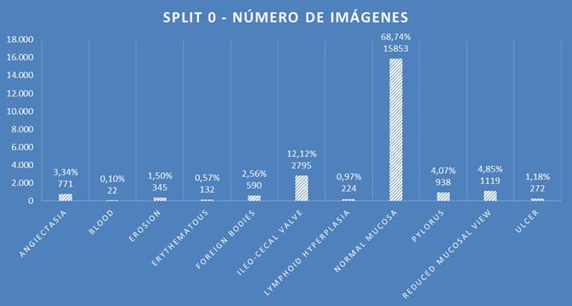
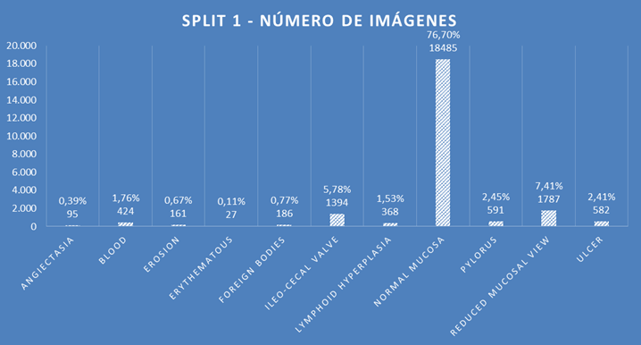

# Capstone Project: Cápsula Endoscópica
**Universidad:** Universitat de Barcelona (UB)
**Estudios:** Postgrado de Introducción a la Data Science y al Machine Learning

**Integrantes del equipo:**
 - Javier Sánchez Molino
 - Sergio Bravo Allué
 - Marc Bernabé Espinosa
 - Josep Fontana Castillo


## 1. Introducción y Objetivo
A partir de 44 vídeos de exploraciones endoscópicas de los que se han extraído distintos fotogramas como imágenes, clasificarlas en un total de 14 clases diferentes según el tipo de anomalía o parte del cuerpo presente en la imagen.

Los datos consisten en un total de 47.238 imágenes etiquetadas según las 14 clases detalladas a continuación:
* A) Angiectasia
* B) Blood
* C) Erosion
* D) Erythematous
* E) Foreign Bodies
* F) Ileo-cecal valve
* G) Lymphoid Hyperplasia
* H) Normal mucosa
* I) Pylorus
* J) Reduced Mucosal View
* K) Ulcer
* Ampulla of vater
* Hematin
* Polyp

Su distribución presenta el siguiente aspecto:


Se observa ya que los datos están muy desvalanceados, con la clase *Normal mucosa* concentrando casi el 73% de las imágenes, y la *Reduced Mucosal View* más del 6%.

En cuanto al significado de cada clase, el *pylorus* es el punto de unión del estómago y el intestino delgado, y la *ileocecal valve* marca la transición entre el intestino delgado y el grueso. De las 9 clases restantes, la *normal mucosa* corresponde a imágenes en las que se ve con claridad la mucosa del intestino delgado, mientras que la clase *reduced mucosal view* corresponde a una imagen poco clara o con elementos que dificultan la visión de la mucosa. Las 7 clases restantes sí corresponden a patologías del sistema gastrointestinal y están representadas en total por el 8,89% de las imágenes del dataset.

En el *paper* original [Kvasir-Capsule, a video capsule endoscopy dataset](https://osf.io/gr7bn/) que trata estos datos se descartan las 3 últimas clases (ver histograma anterior) debido a su escasa representación (10, 12 y 55 imágenes, respectivamente). Así pues, el problema de clasificación se centrará en las 11 clases restantes y un total de 47.161 imágenes.

A pesar de la distinta naturaleza que presentan las diferentes clases no se les da un tratamiento diferenciado como problema de clasificación.

En el *paper* original se utilizan dos modelos de clasificación. Ambos corresponden a redes neuronales convolucionales (CNN, por sus siglas en inglés) con arquitecturas que han demostrado tener un buen comportamiento en la clasificación de imágenes del sistema gastrointestinal a partir de colonoscopias normales (no de imágenes procedentes de una cápsula endoscópica ingerida):

* ***ResNet-152***: arquitectura ganadora de la *ImageNet Challenge* (ILSVRC) de 2015 formada por una CNN con 152 capas que presentaba como principal innovación el uso de *skip connections*, es decir, la unión del input de una capa al output de otra capa varios niveles por encima.
    <font color='red'>**AFEGIR REFERENCIA AURÉLIEN**<font color='black'>
* ***DenseNet-161***: se caracteriza por presentar conexiones densas entre las distintas capas mediante los llamados [*dense blocks*](https://paperswithcode.com/method/dense-block), en los que las capas que lo componen están todas conectadas entre sí directamente unas con otras. Para mantener la naturaleza de retroalimentación de las CNN, cada capa dentro de un *dense block* obtiene inputs adicionales de todas las capas precedentes, y pasa su propio *feature-map* a las capas siguientes.

El objetivo del presente proyecto es desarrollar una metodología mediante un dataset de imágenes obtenidas a partir de los fotogramas de vídeos grabados por cápsulas endoscópicas que permita, dada una imagen, detectar de forma automática las distintas anomalías del aparato gastrointestinal que puedan verse.

Para lograr este objetivo nos basaremos en el *paper* mencionado en el que ya se explotan estos datos y se les aplican distintos modelos de redes neuronales convolucionales. Un hito intermedio consistirá en tratar de replicar los resultados obtenidos en la investigación original.
    
Además, con el fin de adquirir conocimientos sobre redes neuronales, otro hito consistirá en experimentar los efectos en los resultados de las distintas variaciones en los parámetros de los modelos y los tratamientos de los datos, así como ampliar el estudio a otros modelos y estrategias que permitan obtener una mejor clasificación de las imágenes según distintas métricas.

## 2. Metodología

<a id="datos"></a>
### 2.1. Datos

Se ha descargado el *dataset* original del [link](https://osf.io/dv2ag/) especificado en el *paper*. Existe un fichero comprimido por clase. Una vez descomprimidos todos, la estructura del dataset consiste en 14 carpetas, una para cada clase, con las imágenes incluidas en la carpeta de la clase correspondiente. Además, también se facilita un fichero *metadata.csv* en el que se informa de la relación entre cada imagen, el vídeo del que proviene, y la clase a la que pertenece y, en el caso de tratarse de una anomalía, se especifican los 4 puntos de la imagen que definen los vértices del marco en el que se puede observar la anomalía dentro de la imagen.

Los autores dividieron los datos en dos subgrupos (*split 0* y *split 1*) e hicieron el doble ejercicio de aplicar ambos modelos tomando el primer subgrupo de datos para entrenar, y el segundo para validar, y viceversa.

El *split 0* presenta la siguiente distribución por clases:



El *split 1*, en cambio, presenta la siguiente distribución por clases:



Vemos que la división no respeta las proporciones entre clases del dataset original (ver histograma del apartado anterior). En particular en el *split 1* observamos como la clase *Normal mucosa* está sobrerepresentada, teniendo en cuenta que en los datos originales ya es la clase que genera mayor desvalanceo al concentrar casi el 73% de las imágenes. Así pues, cuando se evalúen los resultados de los distintos modelos en función de las métricas sobre el *split 1* convendrá tener en cuenta que un modelo que asignase a todas las imágenes la clase *Normal mucosa* tendría una *accuracy* global del 76,7%. Será importante utilizar otras métricas, como por ejemplo la *F1-score* (ver apartado [3.6](#metricas)).
    
Dada una clase, si comparamos las imágenes que hay en cada uno de los dos *splits*, observamos que la división no parece haberse realizado de forma aleatoria, puesto que las imágenes de un *split* dada una clase son muy similares entre sí, pero muy diferentes entre los dos *splits*. Parece que el criterio para dividir en dos el dataset ha consistido en respetar el vídeo del que proviene cada imagen, de modo que dado un vídeo y una clase, sólo existen imágenes de ese vídeo y clase en uno de los dos *split*, pero no en los dos. Por ejemplo, si consideramos la clase *Foreign Bodies*, las primeras imágenes del *split 0* son las siguientes:
    


El nombre de las imágenes indica el vídeo del que proviene, en este caso, el código del vídeo es *3ada4222967f421d* para todas ellas, y se confirma además que muchas de las imágenes son muy parecidas entre sí al corresponder a momentos del vídeo consecutivos.
<br>

Si lo comparamos con las primeras imágenes de la misma clase, pero del *split 1*, nos encontramos con:
    

    
Y corresponden a otro vídeo (*8885668afb844852*). Además, se ha confirmado que no existe en este segundo grupo ninguna imagen del vídeo *3ada4222967f421d*.

    
Así pues, una de las variaciones que consideraremos más adelante (ver apartado [3.1](#splits)) será realizar otras divisiones de los datos para ver si afecta de manera significativa al resultado final.
    

<a id="codigo"></a>
### 2.2. Código
El [script](https://github.com/simula/kvasir-capsule) original está desarrollado en Python y utiliza ***PyTorch*** como librería principal de Deep Learning. Sin embargo, hemos preferido hacer uso de [Keras](https://keras.io/) para el presente proyecto. ***Keras*** es una API de Deep Learning de alto nivel construida sobre [TensorFlow 2](https://www.tensorflow.org/) y su extensivo uso en toda la comunidad de usuarios y desarrolladores de Deep Learning nos ha permitido disponer de un gran número de recursos y ayudas. Además, resulta idónea para introducirse en esta disciplina y poder utilizar los modelos con mejor comportamiento sin necesidad de conocimientos previos especializados ni una comprensión profunda de su implementación.


<a id="entorno"></a>
### 2.3. Entorno de ejecución
La manipulación de todas las imágenes así como el entrenamiento de los modelos ha resultado ser muy exigente en cuanto a capacidad de memoria RAM requerida, así como potencia de cálculo. Así pues, aquellos componentes del equipo sin disponibilidad de un ordenador potente con GPU han tenido que realizar las ejecuciones en Google Collab.

El resultado de las ejecuciones incluídas en este documento se han obtenido con una máquina Xeon con GPU Quadro RTX4000 (8GB de RAM). El sistema operativo que ejecuta el equipo es Debian 11, que junto con las librerías de Cuda 11.7 + cuDNN, nos ha permitido entrenar con GPU y así obtener el máximo rendimiento de este proceso.
    
Uno de los problemas que nos hemos encontrado es la limitación de la memoria RAM de la GPU, ya que Keras no está preparado para utilizar memoria compartida. Este hecho limitante nos ha obligado a entrenar con imágenes con el tamaño reducido, tal y como se explica en el apartado [3.2](#preprocesado).
    
Finalmente, otro punto limitante en Keras es la *no* posibilidad de poder usar 2 GPUs en paralelo para poder hacer el entrenamiento. Desconocemos si otras plataformas como PyTorch soportan estas características y así permiten entrenamientos mucho más rápidos.

## 3. Estudios realizados
Se presentan numerosas alternativas a probar y contrastar que además pueden combinarse entre ellas de distintas formas. A continuación se enumeran y explican las que hemos decidido estudiar, y los resultados obtenidos en cada caso.

<a id="splits"></a>
### 3.1. Splits de los datos
Además de la subdivisión utilizada en el *paper* original que asegura la coherencia a nivel vídeo y clase entre los dos subgrupos, también hemos decidido probar un *split* extra, consistente en utilizar el 30% de los datos para validación sin garantizar la independencia de las imágenes entre los dos subgrupos. Es decir, asignando imágenes de una determinada clase provenientes de un mismo vídeo arbitrariamente al subgrupo de entrenamiento y al de validación.

La división se ha realizado de forma **estratificada**, es decir, manteniendo la proporción original de imágenes de las distintas clases entre el subgrupo de entrenamiento y el de validación, porque el proceso de división que realiza la función `image_dataset_from_directory` cuando se le da un valor entre 0 y 1 al parámetro `validation_split` consiste en seleccionar *para cada clase* el porcentaje de imágenes representado por el parámetro como grupo de validación, de modo que se mantendrá en todo momento la proporción entre clases del dataset original.
    

A continuación se muestran dos gráficas correspondientes a fijar la arquitectura *ResNet-152* sin técnicas de *data augmentation* y con pesos (ver apartado [3.4.1](#pesos)), y variar el *split* del dataset:

<table><tr>
<td> 
  <p align="center" style="padding: 10px">
    
    <br>
    <em style="color: grey">Splits originales 0 y 1</em>
  </p> 
</td>
<td> 
  <p align="center">
    
    <br>
    <em style="color: grey">Split 30% validation</em>
  </p> 
</td>
</tr></table>
    
    
Observamos que con el *split* original el modelo tiene un mal comportamiento, asociado a la presencia de ***overfitting***, al presentar una gráfica de la *function loss* creciente en función de las *epochs* para el conjunto de validación. Lo que significa que el modelo ajusta correctamente los datos de entreno (gráfica *epochs-function loss* decreciente), pero no los de validación. Sorprendentemente, con el otro *split* parece ser que el modelo sí presenta un comportamiento correcto al tener una gráfica *epochs-function loss* decreciente para validación.
    
Sin embargo, la interpretación de estos resultados lleva a equívoco. La clave consiste en tener en cuenta lo comentado sobre los datos y los *splits* originales en el punto [2.1](#datos): los dos subgrupos de imágenes respetan los vídeos de los que proviene cada imagen, de modo que todas las imágenes de una clase que provengan de un mismo vídeo van exclusivamente a uno de los dos subgrupos. Cuando el *split* se realiza de forma estratificada (en nuestro caso con el 30% de imágenes para validación) sí se están asignando imágenes de un mismo vídeo tanto al subconjunto de entrenamiento como al de validación y, tal y como se ha comentado, las imágenes de un mismo vídeo acostumbran a ser muy parecidas entre sí.
    
Por tanto, lo que ocurre con los *splits* originales es que las imágenes de validación son muy distintas a las de entrenamiento y el modelo demuestra hacer *overfitting* y no ser capaz de generalizar correctamente. Con el *split* estratificado las imágenes de validación son muy parecidas a las de entrenamiento, al provenir de los mismos vídeos, y el modelo parece generalizar correctamente cuando en realidad lo que hace es clasificar correctamente imágenes que básicamente son las mismas con las que ha entrenado. Así pues, **los modelos no generalizan correctamente**, y no los consideramos válidos.


<a id="preprocesado"></a>
### 3.2. Preprocesado y Data Augmentation
Después de [cargar](https://www.tensorflow.org/tutorials/load_data/images?hl=en) todas las imágenes mediante las utilidades específicas de Keras, el **preprocesado** básico a aplicar consiste en reescalar las imágenes para que los valores de los píxels no esté comprendido en el rango usual de [0,255] sino que cubra el intervalo de valores [-1,1] o bien [0,1].

Todas las redes de la familia *ResNet* tienen su propio método de [preprocesado](https://www.tensorflow.org/api_docs/python/tf/keras/applications/resnet50/preprocess_input) para homogeneizar los inputs al tamaño de las imágenes originales con las que se entrenaron las redes. La función que realiza automáticamente este reescalado es la `tf.keras.applications.resnet50.preprocess_input`. Asume que las imágenes de entrada vienen con tres canales de color RGB y valores de los píxeles en el rango de [0,255]. Internamente transforma las imágenes con los tres canales de color en formato BGR, y valores centrados en 0 según el dataset de ImageNet, sin reescalar.
    
En cambio, para la familia de redes *DenseNet* la función de [preprocesado](https://www.tensorflow.org/api_docs/python/tf/keras/applications/densenet/preprocess_input) a utilizar es la `tf.keras.applications.densenet.preprocess_input`, cuya principal diferencia respecto la de las *ResNet* es que sí reeescala los inputs para dejar todos los valores en el rango [0,1].
    
Finalmente, para la famila *EfficientNet* la [función](https://www.tensorflow.org/api_docs/python/tf/keras/applications/efficientnet/preprocess_input) es la `tf.keras.applications.efficientnet.preprocess_input ` y no realiza ningún tipo de transformación, puesto que la red trata directamente imágenes con valores de los píxeles en el rango [0,255].
    
El tamaño de las imágenes originales es de 336x336 píxeles y una resolución de 96ppp. El dataset completo ocupa unos 560MB, lo que dificulta su procesamiento con los modelos que hemos utilizado, que ya de por sí son muy exigentes en cuanto a potencia de cálculo y memoria RAM necesaria. Con nuestras máquinas (ver apartado [2.3](#entorno)) nos hemos visto obligados a reducir el tamaño de las imágenes de entrada a 64x64 píxeles.

El método de **Data Augmentation** consiste en incrementar artificialmente el número de imágenes del subgrupo de entrenamiento mediante la generación de variantes realistas de las imágenes originales. De este modo se reduce el *overfitting* del modelo y funciona como técnica de **regularización**. <font color='red'>***INCLOURE REFERÈNCIA A LA PAG. 613 DE L'AURELIEN***

<font color='black'> 

Las técnicas para generar nuevas imágenes consisten en aplicar de forma aleatoria giros, simetrías, modificaciones del contraste o zooms sobre determinadas zonas de la imagen original. Ésta última opción la hemos descartado por considerar que podría llevar a equívoco al modelo si justo se hace zoom sobre una zona en la que no se encuentra la anomalía correspondiente, puesto que la imagen resultante siempre se etiqueta igual que la de partida. En el *script* original tampoco aplican zooms, pero sí el resto de técnicas. Sin embargo, en el *paper* se afirma que no se ha aplicado ninguna técnica de *data augmentation*, a pesar de estar presentes en el *script*. Por tanto, hemos decidido no aplicarlas por defecto en nuestras pruebas. De todos modos, sí las hemos aplicado en algún caso concreto, para determinar si el resultado mejora o no.

<br>

Existe la opción de realizar la *data augmentation* como parte del preprocesado, antes de enviar las imágenes al modelo. Sin embargo, también pueden incorporarse [capas iniciales extras](https://www.tensorflow.org/tutorials/images/data_augmentation?hl=en) en la CNN que se encarguen de realizar este incremento de imágenes y que sólo aplicará cuando se trate del subconjunto de entrenamiento. 
    
Nosotros hemos optado por esta segunda opción:
    
```python
    inputs = keras.layers.RandomFlip("horizontal_and_vertical")(inputs)
    inputs = keras.layers.RandomRotation(0.6)(inputs)
    inputs = keras.layers.RandomContrast(0.5)(inputs)
```

Con la arquitectura *ResNet-152* y sin aplicar pesos, se han obtenido los siguientes resultados:

<table><tr>
<td> 
  <p align="center" style="padding: 10px">
    
    <br>
    <em style="color: grey">Sin data augmentation </em>
  </p> 
</td>
<td> 
  <p align="center">
    
    <br>
    <em style="color: grey">Con data augmentation</em>
  </p> 
</td>
</tr></table>
    
No parece que la *data augmentation* afecte de forma significativa a los resultados. Lo confirmamos contrastando ambas matrices de confusión:
    
<table><tr>
<td> 
  <p align="center" style="padding: 10px">
    
    <br>
    <em style="color: grey">Matriz de confusión sin data augmentation </em>
  </p> 
</td>
<td> 
  <p align="center">
    
    <br>
    <em style="color: grey">Matriz de confusión con data augmentation</em>
  </p> 
</td>
</tr></table> 
    
Si nos fijamos en los números de la diagonal principal, incluso parece que la opción sin *data augmentation* arroja mejores resultados.
    

<a id="modelos"></a>
### 3.3. Arquitecturas de modelos CNN - Transfer Learning


De las dos arquitecturas distintas de CNN que se utilizan en el *paper* original, la **DenseNet-161** no está disponible en Keras, sólo en PyTorch. Sin embargo, después de explorar las distintas opciones de arquitecturas que nos ofrece Keras, hemos decidido sustituirla por una de parecida, la *DenseNet-169*.

Así pues, hemos utilizado tres arquitecturas de CNN distintas:

1. ***ResNet-152***
    
2. ***DenseNet-169***: tiene un nivel de *accuracy* sobre ImageNet ligeramente [inferior](https://paperswithcode.com/model/densenet?variant=densenet-161) a la *DenseNet-161*, pero las consideramos suficientemente asimilables.
    
3. ***EfficientNet-B1***: la familia de redes *EfficientNet* fueron introducidas por primera vez en el paper "[EfficientNet: Rethinking Model Scaling for Convolutional Neural Networks](https://arxiv.org/abs/1905.11946)" de 2019, y se caracterizan por presentar un equilibrio excelente entre número de parámetros y nivel de acierto en la clasificación respecto a otras redes ampliamente utilizadas, tal y como puede verse en el gráfico de más abajo. Además, la construcción de las distintas redes de la familia se basa en el modelo base *B0* que se reescala de forma uniforme para cada dimensión de la CNN (anchura, profundidad y resolución). <font color='red'> ***AFEGIR REFERÈNCIA (https://ai.googleblog.com/2019/05/efficientnet-improving-accuracy-and.html)***

A continuación se muestra una gráfica comparativa entre distintos modelos según el número de parámetros utilizados y el nivel de *Top-1 Accuracy* sobre la base de imágenes de ImageNet:


    
Se ha decidido utilizar la variante *EfficientNet-B1* por presentar un número reducido de parámetros y una *Top-1 accuracy* superior a la de la *ResNet-152* y *DenseNet-201*.
    
Para los tres modelos se ha seguido una metodología de **transfer learning** estricta en la que se han mantenido los pesos originales de los modelos entrenados con la base de imágenes de ImageNet, quitándoles sólo la última capa, correspondiente al clasificador final. En todos los casos, para quitar la última capa totalmente conectada (densa) de salida, en el momento de carga de la CNN preentrenada se especifica el parámetro `include_top=False`.
    
La estructura del código para todos los modelos utilizados es la misma, la única variación entre los scripts es el modelo preentrenado utilizado y el preprocesamiento de datos asociado a cada uno de ellos (ver apartado [3.2](#preprocesado)). Las capas que se han añadido son las siguientes:
    
```python
    x = keras.layers.Dropout(0.4)(x)      
    x = keras.layers.Dense(sizeLayerExtra, activation='relu')(x)
    x = keras.layers.Dropout(0.2)(x)   

    out = keras.layers.Dense(num_classes, activation='softmax')(x)  
```
    
La última capa corresponde, por supuesto, al clasificador final según las 11 clases, y después de realizar diversas pruebas la dimensión de la capa densa se ha fijado en `sizeLayerExtra=64` para todos los modelos.
    
El parámetro de las capas de *Dropout* indica la probabilidad que en cada paso cualquier neurona de entrada sea ignorada. Aunque pueda sorprender que una técnica destructiva de este tipo funcione, ha demostrado ser en términos generales una buena estrategia para  evitar *overfitting*, es decir, funciona como técnica de regularización que sólo aplica durante la etapa de entrenamiento.


Si fijamos como *split* a utilitzar el original del *paper*, no aplicamos técnicas de *data augmentation* y asignamos pesos según lo descrito en el apartado [3.4.1](#pesos), los resultados para los distintos modelos son:
    
<table><tr>
<td> 
  <p align="center" style="padding: 10px">
    
    <br>
    <em style="color: grey">Modelo ResNet-152</em>
  </p> 
</td>
<td> 
  <p align="center">
    
    <br>
    <em style="color: grey">Modelo DenseNet-169</em>
  </p> 
</td>
<td> 
  <p align="center">
    
    <br>
    <em style="color: grey">Modelo EfficientNet-B1</em>
  </p> 
</td>
</tr></table>
    

Sí se observa cómo en el entrenamiento el modelo *DenseNet-169* llega a niveles de *accuracy* superiores respecto la *ResNet-152*, así como a valores de la función de coste inferiores. La *EfficientNet-B1* parece situarse en un punto intermedio entre las otras dos y es el único modelo de los tres que podría sospecharse que, con suficientes *epochs*, podría llegar a tener una gráfica decreciente de la *loss function* para el conjunto de validación.
    
En cualquier caso, la principal conclusión a extraer de estos resultados es que todos los modelos presentan *overfitting* puesto que sus curvas de validación, tanto en términos de función de coste como de *accuracy*, nada tienen que ver con las de entrenamiento.
    

Aunque no se ha llegado a probar, para refinar este proceso de *transfer learning*, después de esta primera fase en la que se fijan los pesos de la red original y se entrenan exclusivamente las capas extras añadidas, se podría plantear una segunda fase que consistiría en descongelar algunas de las capas superiores de la CNN reaprovechada y reentrenarla con nuestros datos, pero con un *learning rate* inferior para no modificar demasiado los pesos originales preentrenados. Generalmente, con esta técnica se acostumbra a obtener mejores resultados.


### 3.4. Hiperparámetros de los modelos
    
<a id="pesos"></a>
#### 3.4.1. Pesos por clase - Datos desbalanceados

Según lo ya comentado, nuestros datos están muy desbalanceados, con muy poca representación de muchas de las clases correspondientes a anomalías, y la clase *Normal mucosa* sobrerepresentada con un 73% de las imágenes. Una posible solución al problema consiste en aplicar pesos por clase a la función de coste (*loss function*) de modo que las clases infrarepresentadas pesen más y, por tanto, se las tenga más en cuenta en la minimización del coste global.
    
La implementación de estos pesos ha consistido en informar en el método `fit()` del modelo el parámetro `class_weight` con un diccionario en el que las distintas clases son las claves, y el peso que queremos dar a cada clase en la función de coste, el valor asociado a la clave.
    
En el *paper* original utilizan unos pesos por clase que probablemente se hayan obtenido mediante un proceso de *prueba-error*, utilizando el juego de pesos que dio un mejor resultado. Al no poder replicar el proceso de obtención de estos pesos, hemos preferido no utilizarlos y calcularlos nosotros mismos.
    
A pesar de existir funciones ya implementadas, como por ejemplo en la librería Sklearn, la función ` sklearn.utils.compute_class_weight()` (a la que como primer parámetro, se le debería pasar `balanced`), hemos preferido definir nuestra propia función para tener pleno control sobre el método de cálculo y así poder experimentar con distintas fórmulas. Finalmente, aunque hemos probado otras alternativas, el método seleccionado se corresponde con el que calcula internamente la función mencionada de Sklearn, que obedece a la siguiente fórmula:
    
$$ class\_weight_i = \frac{numero\_de\_imagenes}{num\_clases · num\_imagenes\_clase\_i}  $$
    
Para ser coherentes con el tratamiento a dar al *split*, estos pesos se calculan exclusivamente con el subgrupo de entrenamiento, sin tener en cuenta el de validación. Así pues, con *splits* no estratificados sería esperable un mal comportamiento.
    
A continuación mostramos los resultados obtenidos con la arquitectura *ResNet-152*, sin *data augmentation* y el *split* original del *paper*:
    
<table><tr>
<td> 
  <p align="center" style="padding: 10px">
    
    <br>
    <em style="color: grey">Sin pesos por clase</em>
  </p> 
</td>
<td> 
  <p align="center">
    
    <br>
    <em style="color: grey">Con pesos por clase</em>
  </p> 
</td>
</tr></table>
    
    
Se oberva que la versión sin pesos alcanza mayores niveles de *accuracy* y menores valores de la función de coste, por lo que sería preferible. De todos modos, ambos modelos presentan *overfitting* por los mismos motivos que los expuestos en el apartado [3.1](#splits).
    
    
Como alternativa a los pesos a nivel de clase, también existe la posibilidad de asignar pesos a nivel de input mediante el parámetro `sample_weight`. Esta opción podría ser de utilidad, por ejemplo, en el caso de tener un dataset con unos inputs etiquetados por expertos, y otros inputs etiquetados por no profesionales y, por tanto, potencialmente menos fiables que los primeros. En esta situación, se podría querer sobreponderar los inputs etiquetados por expertos en detrimento del resto.
    
<font color='red'>***INCLOURE REFERÈNCIA A L'AURELIEN PAG. 397***

<font color='black'>

La ponderación por input sustituye a la ponderación por clases. Esto es, no son compatibles entre sí. En nuestro caso, a pesar que en el *paper* original sí hacen el ejercicio de aplicar pesos a nivel de *sample*, no hemos explorado esta opción al no considerar que tenga demasiado sentido con el dataset dado.

    
Finalmente, también se podría explorar la posibilidad de fijar los pesos en función del vídeo del que proviene cada imagen, de modo que una clase con muchas imágenes del mismo vídeo la consideraríamos infrarepresentada, mientras que otra clase con pocas imágenes, pero de vídeos distintos, no. Se trataría de dar mayor peso a las clases con infraponderación de vídeos, no de número de imágenes directamente.


<a id="optimizador"></a>
#### 3.4.2. Learning rate y Optimizador
    
<font color='red'>***INCLOURE LA TEORIA DE L'AURELIEN SOBRE EL LEARNING RATE I OPTIMITZADOR 'ADAM'***

<font color='black'>

    
<a id="pooling"></a>
#### 3.4.3. Parámetro *pooling*
    
Al quitar las capas superiores mediante el parámetro `include_top=False` (ver apartado [3.3](#modelos)), la red devuelve un tensor de cuatro dimensiones propio de la salida de un bloque convolucional que corresponden, respectivamente, al tamaño del *batch*, la altura del *kernel* o *receptive field*, la anchura del *kernel* o *receptive field* y al número de *feature mappings* o filtros. Para poder aplicarle el clasificador final es necesario agregar las dimensiones de modo que la salida resultante tenga sólo dos dimensiones. 
    
Con este fin, en los distintos ejercicios de *transfer learning* realizados ha resultado ser clave el parámetro `pooling` en el momento de cargar el modelo preentrenado, puesto que mediante el parámetro `pooling='avg'`, se indica que debe calcularse una media global con los pesos del último bloque convolucional del modelo preentrenado de modo que reduce el tensor de 4D a 2D.

Como alternativa, se puede especificar `pooling='max'` para indicar que la agregación se realice mediante el cálculo del máximo en lugar de la media, pero no hemos llegado a explorar esta opción al suponer que los resultados no variarían de forma sustancial.

    
<a id="batch"></a>
### 3.5. Batch size
    
Tal y como se explica en el siguiente [artículo](https://stats.stackexchange.com/questions/153531/what-is-batch-size-in-neural-network), el `batch_size` indica el número de instancias (inputs, en nuestro caso, imágenes) que se propagan a la vez a lo largo de la red neuronal. Para cada *batch* se actualizan los pesos (parámetros) de la red neuronal, porque es al nivel *batch* el nivel al que se calcula la estimación del gradiente. Cuanto más pequeño sea el tamaño del *batch* menos cantidad de memoria requerirá el proceso de entrenamiento, pero peor estimación del gradiente realizará, al tener en cuenta sólo una parte de los datos en su cálculo.
    
En cambio, si todos los datos del dataset utilizados para entrenamiento caben en un único *batch*  se conseguirá la mejor estimación posible del gradiente.
    
Con la cantidad de imágenes que tenemos, debemos utilizar un tamaño de *batch* muy inferior al total de imágenes a procesar. Con el fin de determinar si puede llegar a influir el tamaño de *batch* definido, hemos seleccionado la arquitectura *EfficientNet-B1* por ser la que menos parámetros necesita de las tres consideradas (ver apartado [3.3](#modelos)) y, por tanto, la que menor cantidad de memoria consume y procesamiento de cálculo necesita.
    
Por defecto hemos entrenado todos nuestros modelos con un `batch_size=8`, que será nuestro caso base. Sin considerar *data augmentation* y aplicando pesos, se han realizado dos lanzamientos extras, uno con `batch_size=32` y otro con `batch_size=64`. Los resultados se muestran a continuación:
    
<table><tr>
<td> 
  <p align="center" style="padding: 10px">
    
    <br>
    <em style="color: grey">Batch size igual a 8</em>
  </p> 
</td>
<td> 
  <p align="center">
    
    <br>
    <em style="color: grey">Batch size igual a 32</em>
  </p> 
</td>
<td> 
  <p align="center">
    
    <br>
    <em style="color: grey">Batch size igual a 64</em>
  </p> 
</td>    
</tr></table>
    
    
Parece que el comportamiento es el contrario al esperado, y los mejores resultados corresponden al *batch* de menor tamaño. Tratamos de confirmarlo mediante las respectivas matrices de confusión:
    
<table><tr>
<td> 
  <p align="center" style="padding: 10px">
    
    <br>
    <em style="color: grey">Batch size igual a 8</em>
  </p> 
</td>
<td> 
  <p align="center">
    
    <br>
    <em style="color: grey">Batch size igual a 32</em>
  </p> 
</td>
<td> 
  <p align="center">
    
    <br>
    <em style="color: grey">Batch size igual a 64</em>
  </p> 
</td>    
</tr></table>
    
Un análisis más exhaustivo de las matrices de confusión permiten entender el motivo de este comportamiento: con el *batch* de menor tamaño existe una concentración de predicciones en la clase 7 (*Normal mucosa*) tal y como se deduce de observar la columna de la primera matriz correspondiente a esta clase. Recordemos que esta clase concentra el 76,7% de las imágenes en el *split 1*. Así pues, sobrepredecir esta clase en detrimento del resto es la forma más sencilla de aumentar la *accuracy* y disminuir la función de coste. Sin embargo, teniendo en cuenta que estamos aplicando pesos según la representatividad de cada clase, con mayores tamaños de *batch* conseguimos un cálculo del gradiente más preciso y, por tanto, una optimización de la función de coste más sofisticada, lo que se traduce en mejoras del grado de acierto de las clases infrarepresentadas, en detrimento de las sobrerepresentadas, hasta el punto de reducir la *accuracy* global.
    
De todos modos, por cuestiones de rendimiento, hemos fijado en la mayoría de experimentos un `batch_size=8`.
    

Sí se ha confirmado es que el modelo con el mayor tamaño de *batch* se ha entrenado en un tiempo sustancialmente inferior al otro, al tener que realizar menos actualizaciones de los pesos de la red.

    
<a id="metricas"></a>
### 3.6. Métricas

<font color='red'>***DESTACAR CATEGORICAL ACCURACY, ENLLOC D'ACCURACY DIRECTAMENT. AQUÍ ES TRACTARÀ DE DIR QUE S'HAN UTILITZAT LES MÈTRIQUES QUE JA TENIA EL SKLEARN, SENSE NECESSITAT D'HAVER-LES HAGUT DE DEFINIR NOSALTRES MANUALMENT***

<font color='black'>

## 4. Conclusiones

1. El dataset se basa en 44 videos de pacientes potencialmente afectadas por alteraciones gastrointestinales. Se trata de una población de pacientes insuficiente para ofrecer una información estadísticamente relevante. Ademas, presenta muchas clases muy claramente infrarepresentadas. Estas características dificultan su generalización en procesos de aprendizaje automático.


2. El dataset adolece de errores en el etiquetado debido a que las imágenes de una secuencia de video etiquetada con una categoría (una de las dolencias)  puede contener fotogramas de otra categoría diferente, típicamente la etiqueta *Normal mucosa*.


3. La distribución de las imágenes entre los splits 0 y 1 de la publicación científica de referencia obedece a la intención de los autores de garantizar la independencia entre el conjunto de imágenes de entrenamiento y el de validación.


4. Se ha conseguido replicar de forma aproximada los resultados y las métricas de la publicación científica utilizando sus splits de imágenes, los modelos *ResNet-152* y *DenseNet-169* (en lugar de la *DenseNet-161*) con y sin aumentación de datos, y con y sin asignación de pesos.


5. La ejecución de los modelos utilizando todo el dataset original con un 30% de las imágenes para validación sin predeterminar, mejora en apariencia los resultados y las métricas. Un análisis más detallado evidencia que estos buenos resultados se deben a que los datasets de entrenamiento y validación seleccionados de esta manera no son independientes (ver apartado [2.1](#datos)).


6. El ordenador principal en el que se han ejecutado los modelos (ver apartado [2.3](#entorno)) ha requerido de la reducción del tamaño de las imágenes a 64x64 píxeles. Pruebas realizadas en otro equipo con imágenes de 168x168 píxeles han producido resultados similares.


7. Los modelos utilizados han sido *ResNet-152*, *DenseNet-169* y *EfficientNet-B1* con pesos preentrenados, ya que el tamaño del dataset no permitiría entrenar de manera efectiva una gran cantidad de parámetros (ver apartado [3.3](#modelos)). 


8. Los modelos ejecutados con aumentación de datos no han obtenido mejores resultados (ver apartado [3.2](#preprocesado)). Atribuimos este comportamiento a la naturaleza redundante de las imágenes de partida al provenir éstas de un numero reducido de vídeos.


9. Los modelos ejecutados con pesos calculados en base al número de imágenes por clase no ha demostrado mejores resultados (ver apartado [3.4.1](#pesos)). Atribuimos este comportamiento al distinto número de imágenes de cada clase que se han extraído de cada vídeo.


10. Los modelos utilizados corresponden a redes neuronales convolucionales extensamente utilizadas para la clasificación de imágenes que, sin embargo, no se han mostrado capaces de predecir correctamente la mayoría de los casos en las clases menos representadas, que son las que a efectos prácticos resultan más interesantes por corresponderse con anomalías. Por tanto, **no consideramos válidos** los distintos modelos entrenados.

## 5. Siguientes pasos
Entre las múltiples ampliaciones y posibles extensiones del presente proyecto, con el fin único de mejorar los resultados y construir modelos más robustos, destacamos las siguientes:

1. Revisar y corregir el etiquetado del dataset original.


2. Ampliar el dataset con nuevos vídeos, por ejemplo con el autoetiquetado de los 74 vídeos no etiquetados suministrados junto con los 44 etiquetados, y las correspondientes imágenes extraídas a partir de ellos.


3. Enriquecer el dataset con información complementaria que no sean imágenes ni vídeos como, por ejemplo, distintos marcadores sobre el estado de salud del paciente.


4. Efectuar un segundo entrenamiento de cada modelo descongelando las capas finales (ver final del apartado [3.3](#modelos)).


5. Aplicar técnicas del tipo [*active label cleaning*](https://www.nature.com/articles/s41467-022-28818-3) para la mejora de la calidad de datasets con recursos limitados.


6. Aplicar pesos a los modelos mediante otros mecanismos como, por ejemplo, en base al número de vídeos de cada clase.


7. Explorar algoritmos de series temporales y de análisis de vídeos para aprovechar el hecho de hacer el mismo recorrido por el tracto gastrointestinal y generalmente tener una visión desde distintos ángulos de una misma anomalía.


